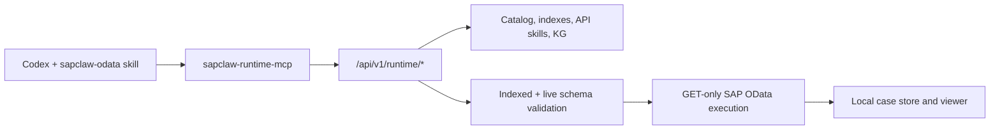

# SAPClaw v2 Architecture

SAPClaw v2 is an LLM-free, read-only SAP OData Runtime. Codex owns interpretation, planning and the final answer. SAPClaw owns evidence retrieval, strict validation, guarded execution, pagination and audit storage.

## Boundaries

- `application/runtime.py` coordinates the Runtime without importing an LLM provider.
- `application/runtime_models.py` defines strict Codex-authored request contracts.
- `api/routes/runtime.py` exposes the HTTP surface; execution routes use internal API-key authentication, while viewer routes require a loopback client.
- `agent_tools/runtime_mcp_server.py` exposes the same Runtime through MCP stdio.
- `infrastructure/sap/live_schema.py` overlays live metadata so stale indexes cannot authorize unavailable entities or fields.

## Readiness

The Runtime has no enable switch. `/health` returns `success` when an executable index, SAP base URL, basic credentials and enabled live-schema provider are present, otherwise `not_ready` with structured issues. Evidence-only operations may still work while SAP execution is not ready.

## Removed v1 architecture

The embedded LLM Router, Planner, Repairer, Critic, Verifier, Presenter, Agent orchestrator, legacy HTTP APIs and legacy MCP server are not part of v2. Git tag `v1.0.0` preserves that architecture.
