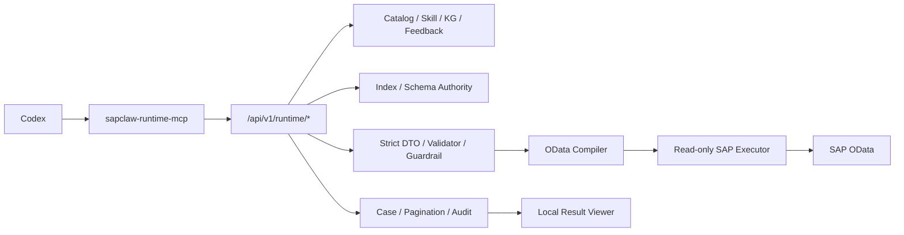
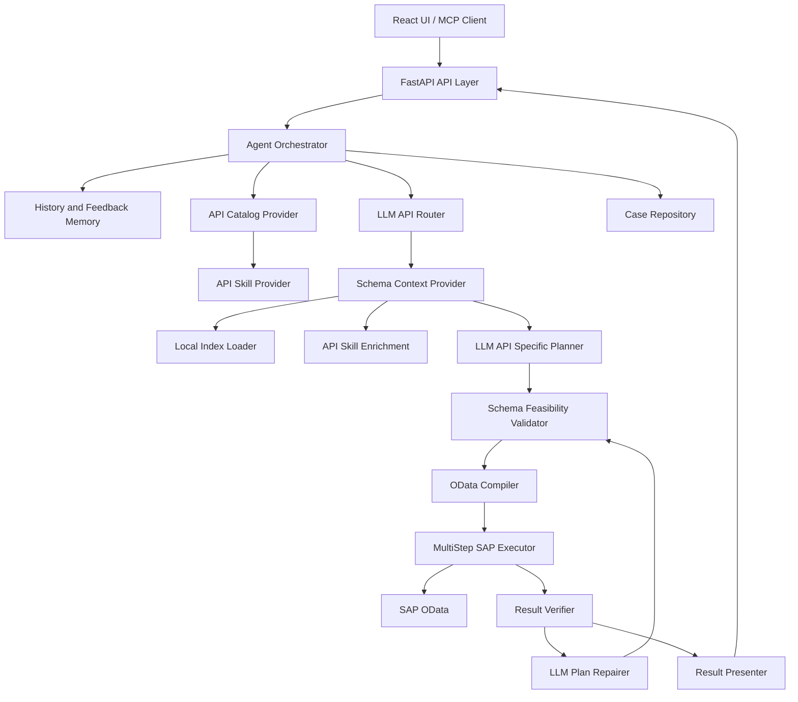

# SAPClaw 架构

## 1. 设计目标

SAPClaw 的目标不是让 LLM 直接拼接 OData URL，而是让 LLM 在本地索引、API skill 和 schema guardrail 的约束下完成自然语言到 SAP OData 查询的规划。

当前核心原则：

1. LLM-first：API 路由、字段选择、查询规划和输出规划优先交给 LLM 理解。
2. Schema-grounded：所有实体、字段、类型、binding 和请求路径必须通过本地索引校验。
3. Skill-backed：单个 API 的特殊业务语义沉淀在 `data/api_skills/<service_name>/skill.md`，避免把 case-by-case 规则写进通用程序。
4. Guardrailed execution：程序负责只读边界、schema 可行性、OData 编译、SAP 执行、分页和审计。
5. Feedback loop：用户反馈、失败归因和可复用经验写入历史与 feedback memory，供后续 Router/Planner 使用。
6. Parallel Thin Runtime：Codex-first 只读 Runtime 与现有 Agent 并行，不改变旧 API、MCP 或前端查询协议。

## 2. Codex-first Thin Runtime（可选）

Thin Runtime 默认关闭，启用后形成一条不依赖 `infrastructure.llm` 的并行链路：



Codex 负责业务理解、API 选择、计划和最终回答；SAPClaw 负责证据、Schema、校验和执行。Skill、KG 与 feedback 不能修改或批准计划，Schema context 仍是执行权威。

Thin Runtime 入口：

- HTTP：`/api/v1/runtime/*`
- MCP：`src/sap_odata_agent/agent_tools/runtime_mcp_server.py`
- 核心服务：`src/sap_odata_agent/application/thin_runtime.py`
- 严格 DTO：`src/sap_odata_agent/application/thin_models.py`
- Codex skill：`skills/sapclaw-thin-odata/`

详细契约和本地配置见 `docs/thin-runtime.md`。

## 3. 现有 Agent 调用链



## 4. 核心模块职责

### 4.1 FastAPI API Layer

- 提供 UI/Agent 查询接口。
- 提供内部只读 API。
- 管理 API key 鉴权边界。
- 返回查询结果、分页结果、历史记录、反馈状态和进度事件。

主要入口：

- UI/Agent：`/api/v1/agent/query`
- 分页：`/api/v1/agent/page`
- 反馈：`/api/v1/agent/feedback`
- 内部只读：`/api/v1/queries`

### 4.2 Agent Orchestrator

- 串联 Router、Schema Context、Planner、Validator、Executor、Verifier、Repair 和 Presenter。
- 记录 timings、attempts、progress events 和 failure attribution。
- 在澄清、多轮修复和失败归因之间做最终裁决。
- 保存成功/失败案例与用户反馈。

### 4.3 API Catalog Provider

- 从 `data/index/*/services.json`、`entities.json`、`fields.json` 构建精简 API catalog。
- 缓存 catalog，避免每次查询重复读取索引。
- 把 API skill 摘要合并到 Router 可见的 catalog 中。

### 4.4 API Skill Provider

- 从 `data/api_skills/<service_name>/skill.md` 加载 API 专属业务知识。
- 按文件签名缓存 skill。
- skill 是业务语义指导，不是 schema 权威；字段和实体仍必须以 schema context 为准。

### 4.5 LLM API Router

- 根据用户自然语言、feedback memory、top fields、API catalog 和 API skill 选择最合适的 API。
- 支持多 API 路由。
- Router JSON 解析失败时做 strict repair/retry，不使用硬编码业务 fallback。
- 对无法 OData 执行的 API view/CDS view 做可路由性过滤。

### 4.6 Schema Context Provider

- 基于选中 API 加载实体、字段、导航和可过滤字段。
- 把 API skill 中提到的字段与当前 schema 做匹配，形成 `skill_field_matches`。
- 为 Planner、Repairer 和 Result Verifier 提供压缩后的 schema context。

### 4.7 LLM API Specific Planner

- 基于 schema context 生成结构化计划。
- 支持多步查询、`filter_from_previous` binding、select fields、filters、orderby、pagination 和 result transform。
- 可以使用 API skill 的 common planning pattern、preferred filters、discouraged filters、select-only pattern 和 result transform pattern。

### 4.8 Schema Feasibility Validator

- 校验 API、entity、field、filter、binding、类型和值是否合法。
- 阻断不存在字段、错误 boolean/date syntax、无效跨步 binding、缺失后续步骤 filter/binding 等问题。
- 保证 LLM 计划不能越过 schema 边界直接执行。

### 4.9 OData Compiler 和 MultiStep SAP Executor

- 把结构化计划编译为 OData V2 请求。
- 统一处理 `$select`、`$filter`、`$top`、`$skip`、`$inlinecount`、日期和布尔值语法。
- 执行单步或多步 SAP 请求。
- 保存 pagination 信息，前端可按页跳转。

### 4.10 Result Verifier、Repairer 和 Presenter

- Result Verifier 判断查询结果是否支持用户的业务结论。
- 若结果不支持业务语义，Repairer 根据 verifier finding、SAP 错误和 schema context 重新规划。
- Failure Diagnoser 负责最终失败归因，但不能反驳 blocking verifier finding。
- Presenter 根据用户意图和计划输出合适字段、表格、摘要和分页文案。

## 5. 本地资产

### 5.1 Runtime Index

运行时索引位于：

```text
data/index/<service_name>/
```

这些文件用于 API 路由、schema context、字段校验、OData 编译和结果验证。

原始 OpenAPI specification JSON 位于 `data/index/<service_name>/raw/*.json`，但不提交到 Git。

### 5.2 API Skills

API 专属 skill 位于：

```text
data/api_skills/<service_name>/skill.md
```

适合沉淀：

- API 的业务用途。
- 常见用户话术。
- 字段业务语义。
- 易误用字段和反例。
- 常见多步规划模式。
- 输出字段和汇总方式建议。

不适合沉淀：

- 用户具体编号。
- 单次测试数据。
- 能由通用 schema validator 解决的规则。

### 5.3 History and Feedback Memory

历史和反馈默认保存在 `data/cases/` 下，本地运行时使用，不应提交真实环境数据。

## 6. 安全边界

- 默认只读查询。
- 写操作需要显式模式和确认，不走默认查询链路。
- 外部部署必须配置 `SAPCLAW_API_KEYS`，并放在 HTTPS 和鉴权网关后。
- 不提交 `env/.env`、API key、SAP 密码、真实测试 case、feedback memory、raw OpenAPI JSON。
- 已提交的 index 文件应避免包含真实主机、租户、凭据或业务数据。

## 7. 当前代码对应关系

- API 层：`src/sap_odata_agent/api`
- 编排器：`src/sap_odata_agent/application/orchestrator.py`
- Schema validator：`src/sap_odata_agent/application/schema_feasibility_validator.py`
- Domain models：`src/sap_odata_agent/domain/models.py`
- API catalog：`src/sap_odata_agent/infrastructure/indexing/api_catalog_provider.py`
- API skill：`src/sap_odata_agent/infrastructure/indexing/api_skill_provider.py`
- Index loader：`src/sap_odata_agent/infrastructure/indexing/index_loader.py`
- LLM Router：`src/sap_odata_agent/infrastructure/llm/api_router.py`
- LLM Planner：`src/sap_odata_agent/infrastructure/llm/api_specific_planner.py`
- Plan Repairer：`src/sap_odata_agent/infrastructure/llm/plan_repairer.py`
- Result Verifier：`src/sap_odata_agent/infrastructure/llm/result_verifier_agent.py`
- SAP executor：`src/sap_odata_agent/infrastructure/sap`
