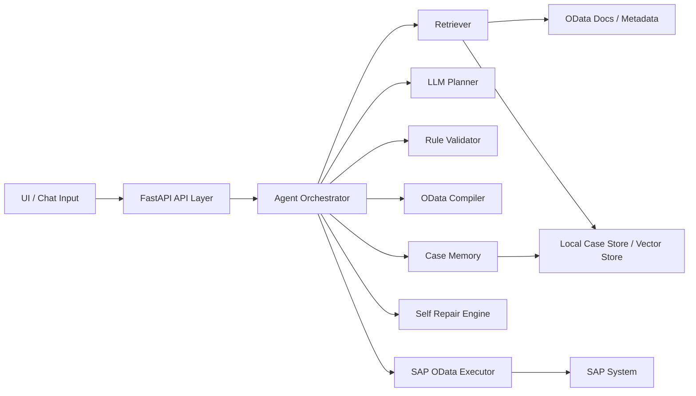

# SAP OData Agent Architecture

## 1. 设计目标

这个 Agent 的目标不是“自由生成 OData 字符串”，而是“在文档约束下稳定地生成、校验并执行可审计的 SAP OData 请求”。

核心原则：

1. LLM 负责语义理解，不直接拥有最终执行权。
2. 程序负责校验、编译、权限控制和审计。
3. 自修复必须有限次，并基于 SAP 返回错误做定向修正。
4. 成功案例和失败案例都要沉淀，供后续检索增强和模型优化。

## 2. 分层架构



## 3. 核心模块职责

### 3.1 API Layer

- 接收 UI 请求
- 区分只读请求和写操作请求
- 返回最终结果、重试轨迹、校验告警

### 3.2 Agent Orchestrator

- 串联整条调用链路
- 控制最大重试次数
- 决定什么时候停止自修复
- 在成功或失败后写入案例库

### 3.3 Retriever

- 检索本地 OData 文档
- 检索 `$metadata` 解析结果
- 检索历史成功/失败案例
- 后续可替换为向量库检索

### 3.4 LLM Planner

- 根据用户输入和检索上下文生成结构化查询意图
- 输出 JSON 结构，而不是直接输出 OData URL

建议输出字段：

- `service_name`
- `entity_set`
- `http_method`
- `select_fields`
- `filters`
- `order_by`
- `top`
- `payload`
- `requires_confirmation`
- `rationale`

### 3.5 Rule Validator

- 校验 service 是否存在
- 校验 entity set 和字段是否合法
- 校验 filter 操作符和值类型
- 校验是否属于危险写操作
- 输出阻断性错误和非阻断性告警

### 3.6 OData Compiler

- 把结构化查询意图编译成 OData URL 或请求体
- 统一转义、编码和过滤器拼接逻辑
- 避免把字符串拼接责任交给模型

### 3.7 SAP OData Executor

- 负责认证、请求发送和响应解析
- 统一处理 SAP 错误信息
- 输出可用于自修复的结构化错误

### 3.8 Self Repair Engine

- 只在有限次数内触发
- 输入包括：
  - 上一轮查询意图
  - SAP 错误信息
  - 检索到的文档约束
- 输出修正后的新查询意图

### 3.9 Case Memory

- 保存成功案例和失败案例
- 保存检索上下文、查询意图、编译结果、执行结果和修复链路
- 为后续向量检索和本地模型训练准备数据

## 4. 推荐数据流

1. 用户在 UI 输入需求
2. API 生成 `AgentRequest`
3. Retriever 找到相关文档和历史案例
4. Planner 生成 `QueryPlan`
5. Validator 校验 `QueryPlan`
6. Compiler 生成 `CompiledRequest`
7. Executor 调用 SAP
8. 若失败，Repair Engine 基于错误信息修正
9. 达到上限或成功后，将完整链路保存为案例

## 5. 为什么不建议直接训练本地小模型

在前期数据量不大时，效果通常是：

- 样本稀疏
- 业务说法不统一
- 字段映射噪声高
- 错误样本质量不稳定

因此更推荐先走下面这条路径：

1. 文档检索
2. 成功案例检索
3. 结构化生成
4. 规则校验
5. 有限次修复

当样本规模和评测体系成熟后，再考虑本地小模型承担这些子任务：

- 意图分类
- service 选择
- entity set 选择
- 字段别名映射
- query template 召回

不建议一开始就让小模型直接端到端生成 OData。

## 6. 建议的案例数据结构

```json
{
  "case_id": "uuid",
  "created_at": "2026-04-10T23:00:00+08:00",
  "user_input": "查询客户 1000001 的基本信息",
  "mode": "read_only",
  "retrieved_documents": [],
  "retrieved_examples": [],
  "initial_plan": {},
  "attempts": [],
  "final_status": "success",
  "final_query_url": "/sap/opu/odata/sap/API_BUSINESS_PARTNER/A_BusinessPartner?$filter=BusinessPartner eq '1000001'",
  "response_preview": {},
  "error_summary": null
}
```

## 7. MVP 边界

第一阶段只做：

- `GET`
- `$select`
- `$filter`
- `$orderby`
- `$top`

暂不做：

- 深层级联写操作
- 自动批量写入
- 自动执行高风险 Action / Function Import
- 无确认的变更类请求

## 8. 安全与治理

- 写操作默认禁止直通
- 高风险请求必须人工确认
- 所有执行请求都要可追溯
- 失败重试要有限次
- 文档和案例入库前要做脱敏

## 9. 演进路线

### 阶段 1

- 骨架搭建
- 本地文档接入
- 只读查询链路打通

### 阶段 2

- 向量检索接入
- 成功案例相似召回
- 更强的错误修复

### 阶段 3

- 构建评测集
- 训练本地小模型做意图分类和字段映射
- 与主 LLM 形成双层协同

## 10. 当前代码骨架对应关系

- API: `src/sap_odata_agent/api`
- Orchestrator: `src/sap_odata_agent/application/orchestrator.py`
- Domain models: `src/sap_odata_agent/domain/models.py`
- Protocols: `src/sap_odata_agent/domain/ports.py`
- Infra implementations: `src/sap_odata_agent/infrastructure`

